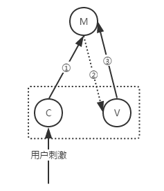
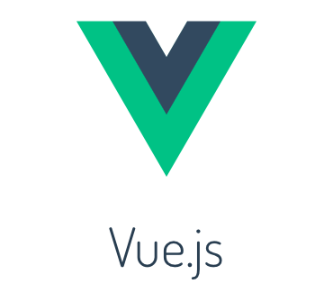

# 前端开发的历史和趋势

---

## 什么是前端

- 前端：针对浏览器的开发，代码在浏览器运行
- 后端：针对服务器的开发，代码在服务器运行


---

## 前后端不分的时代

互联网发展的早期，前后端开发是一体的，前端代码是后端代码的一部分。

1. 后端收到浏览器的请求
1. 生成静态页面
1. 发送到浏览器

---

## 后端 MVC 的开发模式

那时的网站开发，采用的是后端 MVC 模式。

- Model（模型层）：提供/保存数据
- Controller（控制层）：数据处理，实现业务逻辑
- View（视图层）：展示数据，提供用户界面

前端只是后端 MVC 的 V。

---

## 前端工程师的角色

那时的前端工程师，实际上是模板工程师，负责编写页面模板。

后端代码读取模板，替换变量，渲染出页面。

---

## 前端 MVC 框架

前端通过 Ajax 得到数据，因此也有了处理数据的需求。

前端代码变得也需要保存数据、处理数据、生成视图，这导致了前端 MVC 框架的诞生。



- Model：代表业务逻辑层，它无视表现层的存在，只专注处理业务。
- Controller：接受用户的输入，将输入转为相应的命令，执行进一步的操作。
- View：向用户呈现展示的信息，与M建立观察者模式，根据M的改变自动重新渲染。

---

## 前端 MVP 框架

前端通过 Ajax 得到数据，因此也有了处理数据的需求。

前端代码变得也需要保存数据、处理数据、生成视图，这导致了前端 MVC 框架的诞生。


---

## 前端MVVM 模式

另一些框架提出 MVVM 模式，用 View Model 代替 Controller。

- Model
- View
- View-Model：简化的 Controller，唯一作用就是为 View 提供处理好的数据，不含其他逻辑。

本质：(Two-way) Data Binding 数据双向绑定。view 绑定 view-model，视图与数据模型强耦合。数据的变化实时反映在 view 上，不需要手动处理。


---

## 前后端分离

- Ajax -> 前端应用兴起
- 智能手机 -> 多终端支持

这两个原因，导致前端开发方式发生根本的变化。

前端不再是后端 MVC 中的 V，而是单独的一层。

---

## 前端开发模式的根本改变

- Node 环境下开发
- 大量使用服务器端工具
- 引入持续集成等软件工程的标准流程
- 开发完成后，编译成浏览器可以运行的脚本，放上 CDN

---

## 全栈工程师

前端工程师正在转变为全栈工程师

- 一个人负责开发前端和后端
- 从数据库到 UI 的所有开发

---

## 全栈技能

怎样才能称为全栈工程师？

- 传统前端技能：HTML、JavaScript、CSS
- 一门后端语言
- 移动端开发：iOS / Android / HTML5
- 其他技能：数据库、HTTP 等等

---

## SPA

前端可以做到：

> - 读写数据
> - 切换视图
> - 用户交互

这意味着，网页其实是一个应用程序。

> SPA = Single-page application

2010年后，前端工程师从开发页面，变成了开发”前端应用“（跑在浏览器里面的应用程序）。

---

## Angular

Google 公司推出的 Angular 是最流行的 MVVM 前端框架。

它的风格属于 HTML 语言的增强，核心概念是双向绑定。


---

## 示例：Angular 的双向绑定

浏览器打开`demos/angular-demo/index.html`，可以看到一个输入框。

  [演示](./demo/angular-demo/index.html)

---

```javascript
<div ng-app="">
  <p>
    姓名 :
    <input
      type="text"
      ng-model="name"
      placeholder="在这里输入您的大名"
    >
  </p>
  <h1>你好，{{name}}</h1>
</div>
```

---

## Vue

Vue.js 是现在很热门的一种前端 MVVM 框架。

它的基本思想与 Angular 类似，但是用法更简单，而且引入了响应式编程的概念。



---

## 示例：Vue 的双向绑定

Vue 的模板与数据，是双向绑定的。

打开`demo/vue-demo/index1.html`，按照[《操作说明》](./demo/vue-demo/index1.html)，查看示例。


---

HTML 代码

```html
<div id="journal">
  <input type="text" v-model="message">
  <div>{{message}}</div>
</div>
```

JS 代码

```javascript
var journal = new Vue({
  el: '#journal',
  data: {
    message: 'Your first entry'
  }
});
```

---

## 前后端分离

- Ajax -> 前端应用兴起
- 智能手机 -> 多终端支持

这两个原因，导致前端开发方式发生根本的变化。

前端不再是后端 MVC 中的 V，而是单独的一层。

---
