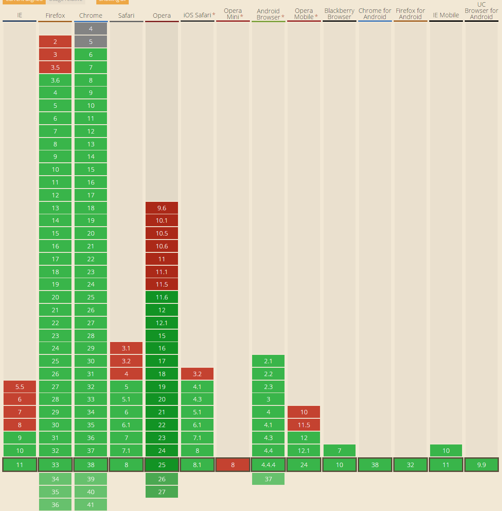

# 相对单位rem

rem(font size of the root element)是指相对于根元素的字体大小的单位。

> rem是相对长度单位，相对于根元素（即html元素） font-size计算值的倍数。
> 使用： 根据根标签html设置文字大小后（大部分浏览器默认为16px），其他标签设置rem都是html大小的倍数。

**移动端开发使用em作为单位**

```
html{
  font-size: 16px;
}

body{
  font-size: 1rem;  // 16px
}

h1{
  font-size: 0.625rem // 10px
}
```

# web app的几种屏幕适配：

1. 固定高度（流式布局）

流式布局通过百分比来定义宽度，但是高度大都是用px固定住。 高度不变，宽度拉伸。

2. 固定宽度

固定宽度，超出部分留白。

3. 响应式
4. 设置viewport进行缩放

```
<meta name="viewprt" content="width=320,maximun-scale=1.3,user-scalable=no">
```

例如：可以以320宽度为基准，进行缩放

5. rem能等比例适配所有屏幕

通过设置html的字体大小可以控制rem的大小，改变html的font-size可以等比改变所有用了rem单位的元素，任何分辨率下，页面的排版都是按照等比例进行切换。可以通过js根据浏览器当前的分辨率改变font-size的值来实现缩放。

```
(function(doc, win){
  var docEle = doc.documentElement,
      resizeEvt = 'orientationchange' in window ? 'orientationchange': 'resize',
      recalc = function() {
        var clientWidth = docEl.clientWidth;
        if(!clientWidth) return;;
        docEl.style.fontSize = 20 * (clientWidth / 320) + 'px';
      };

      if(!doc.addEventListener) return;
      win.addEventListener(resizeEvt, recalc, false);
      doc.addEventListener('DOMContentLoaded', recalc, false);
})(doucment, window);
```

rem使用的浏览器兼容性



常用的rem 单位换算


